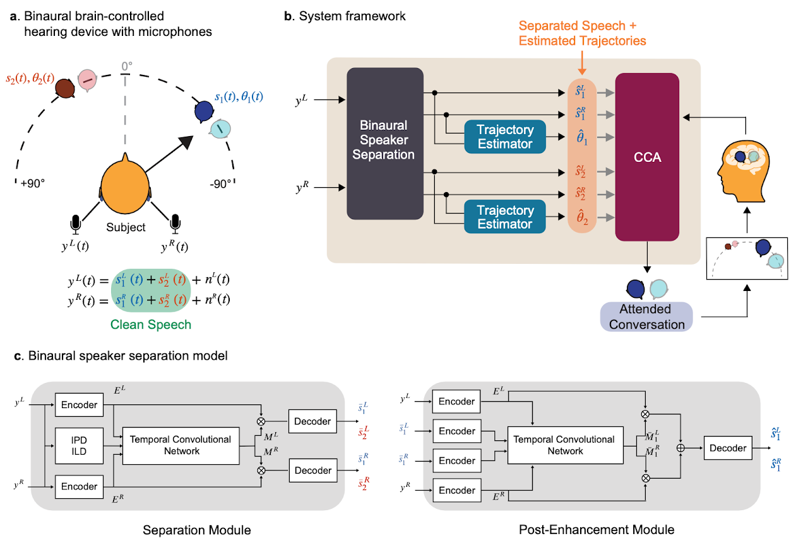

# 🎧 Brain Controlled Augmented Hearing for Moving Conversations

## 🧠 Introduction
Picking out a single voice in a noisy crowd is hard for everyone and can be nearly impossible for people with hearing loss. Conventional hearing aids amplify all sounds, providing little help when competing conversations move around a listener. Brain-controlled augmented hearing offers a different path: read neural signals to understand which talker the listener cares about, then selectively amplify that voice.

This project brings that vision closer to reality by marrying auditory attention decoding (AAD) with spatially aware speech separation. We record invasive EEG (iEEG) from three neurosurgical participants as they follow one of two moving speakers in a noisy environment. A binaural, speaker-independent separation model unmixed the speech mixture while preserving spatial cues and estimating talker trajectories, which in turn support more accurate neural decoding. Together, these components deliver a system that tracks conversations, maintains natural spatial perception, and improves both intelligibility and listening comfort under challenging acoustic conditions—pointing to technology that can support people with hearing difficulties and augment the hearing of those with typical hearing alike.

🏆 This work received **Third Place** at the [2024 International BCI Competition](https://www.bci-award.com/2024).

## 🔍 Overview
This repository provides code and resources for the system evaluated in the project. It contains two main technical components:

1. **Binaural Speech Separation** 🎯 – separates the speech streams of moving talkers while preserving their spatial locations.
2. **Auditory Attention Decoding (AAD)** 🧭 – infers which talker a listener attends to based on recorded neural activity.



## 🎙️ Separating Moving Speakers
This pipeline covers dataset preparation, model training, and inference resources for handling moving-speaker mixtures.

### ✅ Prerequisites
- Python 3.9.16 (tested)
- Packages listed in `requirements.txt`

Install dependencies:

```bash
pip install -r requirements.txt
```

### 📚 Datasets
- [Google Resonance Audio SDK](https://resonance-audio.github.io/resonance-audio/) for spatialization. Supporting scripts are available [here](https://github.com/vishalchoudhari11/GoogleResonanceAudioSpatializer).
- [Pre-generated moving speaker audio](https://drive.google.com/file/d/1XFhzlkn6UKcSMa4JOJXIqj1RkwFpkPre/view?usp=sharing) to skip offline rendering.
- [DEMAND dataset](https://zenodo.org/record/1227121) for additive background noise.

### 🛠️ Training Workflow
Train the separation, enhancement, and localization models sequentially.

#### 🔊 Separation Model
Prepare training data and fit the separation network:

```bash
python create_separation_dataset.py
python train_separation_model.py \
  --training-file-path /path/to/train.json \
  --validation-file-path /path/to/val.json \
  --checkpoint-path /path/to/checkpoints
```

#### 🎛️ Post-enhancement Model
Generate enhancement training examples with the trained separator, then launch training:

```bash
python train_enhancement_model.py \
  --training-file-path /path/to/train.json \
  --validation-file-path /path/to/val.json \
  --checkpoint-path /path/to/checkpoints
```

#### 🧭 Trajectory Prediction Model
Use the enhanced outputs to form localization training data, then fit the trajectory predictor:

```bash
python train_localization_model.py \
  --training-file-path /path/to/train.json \
  --validation-file-path /path/to/val.json \
  --checkpoint-path /path/to/checkpoints
```

## 🧠 Auditory Attention Decoding
This section documents scripts for CCA-based AAD analysis.

- `auditory_attention_decoder/analysis_scripts/train_aad_decoder.m`: trains CCA models that link neural signals to the attended stimulus.
- `auditory_attention_decoder/analysis_scripts/test_aad_decoder.m`: evaluates CCA performance across window sizes and reports correlations with attended versus unattended stimuli.

The CCA implementation builds on the [NoiseTools package](http://audition.ens.fr/adc/NoiseTools/) by de Cheveigné et al.:

> de Cheveigné, A., Wong, DDE., Di Liberto, GM., Hjortkjaer, J., Slaney, M., & Lalor, E. (2018). Decoding the auditory brain with canonical correlation analysis. *NeuroImage, 172*, 206–216. https://doi.org/10.1016/j.neuroimage.2018.01.033

## 🎬 System Demo
Click the thumbnail below to watch the end-to-end system in action:

[](https://www.youtube.com/watch?v=WkRLxWGs1Lo)

## 📄 Citation
> Choudhari, V., et al. (2024). Brain-controlled augmented hearing for spatially moving conversations in multi-talker environments. *Advanced Science, 2401379*. https://doi.org/10.1002/advs.202401379
